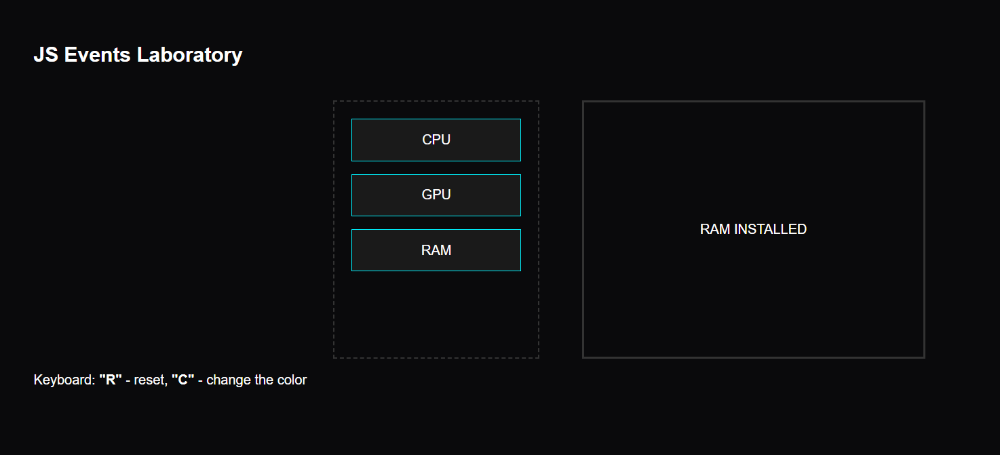

# ⚡ Cyber-Parts Assembly Lab

A futuristic and interactive hardware component builder built with **Vanilla JavaScript**. This project focuses on mastering **DOM Manipulation** and **Advanced JavaScript Events**.


## 🚀 Overview
This lab allows users to interactively drag hardware components (CPU, GPU, RAM) and install them into a system unit. It demonstrates high-performance event handling and a modern "Cyberpunk" UI design.

## 🛠 Features & JS Events Covered
* **Drag & Drop API:** Seamlessly move components using `dragstart`, `dragover`, and `drop`.
* **Keyboard Controls:** * Press `R` to **Reset** the assembly line.
    * Press `C` to **Change** the border color (Dynamic Style Injection).
* **Mouse Dynamics:** Tracks real-time cursor coordinates within the assembly zone.
* **Visual Feedback:** Interactive neon highlights and status logging in the console.

## 📸 Preview


## 📂 Project Structure
```text
├── index.html      # Structural layer
├── style.scss       # Neon UI & Animations
└── script.js       # Core Event Logic